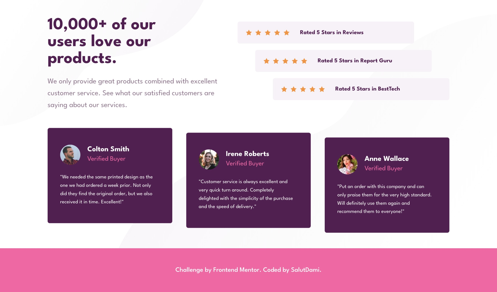
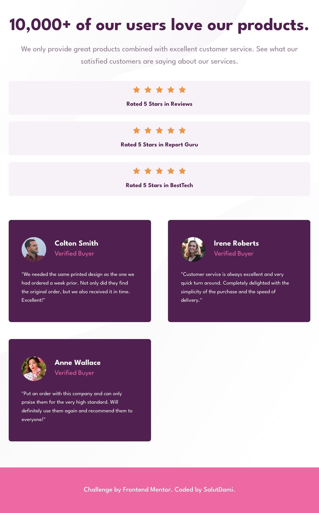
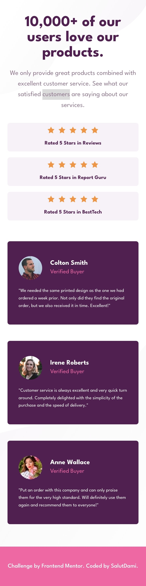

## Table of contents

- [Overview](#overview)
  - [The challenge](#the-challenge)
  - [Screenshot](#screenshot)
  - [Links](#links)
- [My process](#my-process)
  - [Built with](#built-with)
  - [What I learned](#what-i-learned)
  - [Continued development](#continued-development)
- [Author](#author)

## Overview

### The challenge

In this project, the users would be able to:

- View the optimal layout for the section depending on their device's screen size

### Screenshot



_A desktop view of the project_



_A Tablet view of the project_



_A mobile view of the project_

### Links

- Solution URL: [Add solution URL here](https://github.com/salutDami/Social-proof-section)
- Live Site URL: [Add live site URL here](https://salutdami.github.io/Social-proof-section/)

## My process

### Built with

- Semantic HTML5 markup
- CSS custom properties
- Flexbox
- CSS Grid
- Mobile-first workflow

### What I learned

Continued working on my layout structure and I got to use the `transform:translateX() and translateY()` property for the testimonials and the reviews which was a good learning experience for me.

You cna see some snippets on how I was able to do that below:

```css
.social_proof_card:nth-child(1) {
  transform: translateX(-20%);
}

.social_proof_card:nth-child(2) {
  transform: translateX(-10%);
}
```

### Continued development

I hope to do more frontmentor challenges/projects to help me develop and improve my HTML and CSS skills.

## Author

- Twitter - [@\_salutDami](https://www.twitter.com/_salutDami)
- Linkedin- [Ikuomola Stephen](https://www.linkedin.com/in/ikuomola-stephen/)
- Frontend Mentor - [@salutDami](https://www.frontendmentor.io/profile/salutDami)
